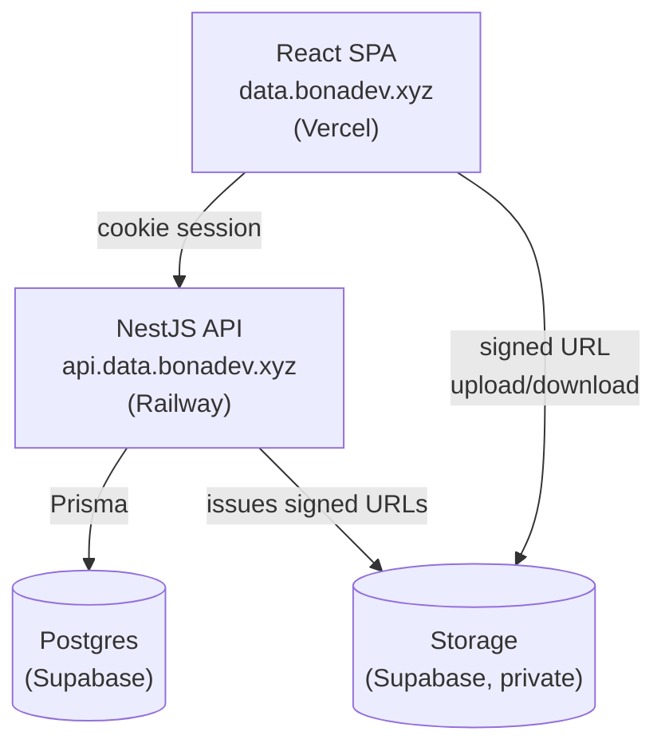
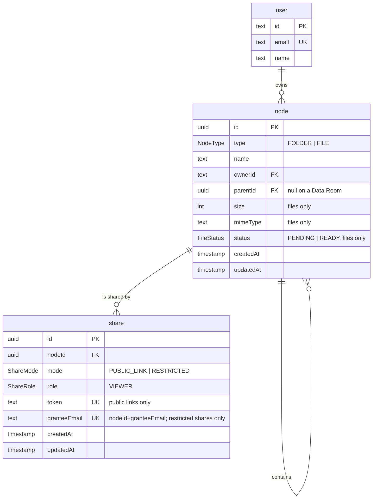

# Data Room

Virtual data room MVP — securely store, organize, and share documents for due
diligence. Full-stack app: NestJS + Postgres/Prisma backend, React frontend.

## Live demo

- Frontend: https://data.bonadev.xyz
- Backend API: https://api.data.bonadev.xyz — health check:
  [`/health`](https://api.data.bonadev.xyz/health)

## Architecture

Full diagram + rationale in [docs/architecture.md](docs/architecture.md).



File bytes go straight from the browser to Storage via signed URLs the API
issues — they never pass through the API itself.

## Tech stack

See [docs/architecture.md](docs/architecture.md) for full rationale.

- Frontend: React (Vite SPA), TypeScript, Tailwind, Shadcn — hosted on Vercel at
  `data.bonadev.xyz`
- Backend: NestJS — hosted on Railway at `api.data.bonadev.xyz`, called directly
  (no proxy)
- Database: Postgres via Supabase
- File storage: Supabase Storage
- Auth: Better Auth (Google OAuth2 + email/password), httpOnly cross-subdomain
  cookie session (`.data.bonadev.xyz`)
- Package manager: pnpm
- Frontend data: TanStack Query + TanStack Table
- Monorepo: pnpm workspaces — `apps/web`, `apps/api`, `packages/shared`
- CI/CD: Vercel/Railway auto-deploy on push to `main` (native git integration);
  GitHub Actions runs typecheck/lint/tests as a required check on PRs

## Design decisions

Full rationale lives in [docs/architecture.md](docs/architecture.md). Summary:

- Frontend: Vite SPA, not Next (not the task's named stack) or TanStack Start
  (immature, and its main draw — same-origin auth — is already solved by
  cross-subdomain cookies on a shared root domain)
- Auth: Better Auth (not Passport), httpOnly cross-subdomain cookie session
  (frontend and backend call each other directly, no proxy), not a client-held
  JWT
- Supabase used for DB + Storage only, not Auth — auth is rolled by hand since the
  task names NestJS + Postgres + Prisma as the expected stack
- pnpm as package manager
- TanStack Table (headless) drives both list and grid views of files/folders from
  one shared sort/filter/pagination state; TanStack Query handles server state
- pnpm workspaces monorepo (no Turborepo/Nx): `apps/web`, `apps/api`,
  `packages/shared` for types/DTOs/zod schemas shared between frontend and backend
- Deploys are native Vercel/Railway git integration, not a GH Actions deploy
  step; GitHub Actions only runs CI (typecheck/lint/tests), required on PRs
- File storage: private Supabase bucket, object key = `fileId`, client uploads
  directly to Storage via backend-issued signed URLs, authorization stays in
  Postgres (no Supabase Storage RLS policies)
- Data model: one `node` table for folders and files, a Data Room being a folder
  without a parent; deletion is permanent and cascades down the subtree

Not yet decided (tracked in docs/architecture.md):

- TODO: folder tree strategy for subtree size & item count aggregation at scale
- TODO: name-conflict resolution on upload/rename

## Data model / ERD



A **Data Room is a folder without a parent** — one per user, enforced by a partial
unique index — so it needs no entity of its own, and sharing a room, a folder or a
file is one code path rather than three. Folders and files live in **one table**
discriminated by `type`, which lets the subtree walk behind counts, sizes, deletion
and access checks be written once. Names are unique within a folder and
case-sensitive; deleting a folder deletes its subtree for good, by cascade.

`share` ships with the tree but isn't read until the sharing slices. Both modes
have shipped: `PUBLIC_LINK` (anyone with the token) and `RESTRICTED` (one row per
invited email, resolved against the caller's session email at read time, no `User`
foreign key). `role` still only ever holds `VIEWER` — per-user roles (viewer/editor)
remain a declared extension point, see "How it scales" below. Rationale for each of
these: [docs/architecture.md](docs/architecture.md#data-model).

## Setup instructions

```bash
corepack enable
pnpm install

cp apps/api/.env.example apps/api/.env   # fill in DB/Supabase/auth values
cp apps/web/.env.example apps/web/.env

pnpm dev   # runs apps/api and apps/web together
```

`apps/api` needs a Postgres connection (`DATABASE_URL`/`DIRECT_URL`) before it can do
anything beyond `/health`. Apply the schema with
`pnpm --filter @data-room/api exec prisma migrate deploy`.

`pnpm test` runs the unit tests; they need no database.

## How it scales

**Sharing already extends to per-user roles (viewer/editor) without remodeling.**
`share.role` sits on the same row as `mode` and `granteeEmail`, scoped to one
`(node, grantee)` pair — adding `EDITOR` is a new `ShareRole` enum value plus a
check in `AccessService`, not a new table or migration shape. `RESTRICTED` mode
already proves the row-per-grantee shape holds: extending it to carry write
permission is additive, the same way `RESTRICTED` was additive to `PUBLIC_LINK`.

**Item count is already a single indexed query, and total size is the same query.**
`subtreeStats` (`apps/api/src/nodes/node-tree.service.ts`) counts a folder's whole
subtree with one `groupBy` filtered on `path: { startsWith: subtreePrefix(node) }` —
an indexed prefix-range scan on the materialized `path` column (the `text_pattern_ops`
index from the S2 model), not a recursive walk. `Node.size` already exists on every
file row, so total size is the same query with `_sum: { size: true }` added next to
`_count: { _all: true }` — no new index, no extra round trip.

**At 100,000 files, listing needs a page size and a real cursor — everything else
already holds.** `listChildrenOf` currently returns a folder's children unpaginated,
sorted `[{ type: "asc" }, { name: "asc" }]`. `name` is already unique per folder
(`@@unique([parentId, name])`, S2), so `(type, name)` is a valid keyset cursor on its
own — pagination doesn't need `id` as a tiebreaker, just a `take` limit and a
`WHERE (type, name) > (cursor)`-style continuation on the same sort. The frontend
side is a `NodeTable` prop change, not a rewrite: it already renders off TanStack
Table, and TanStack Virtual slots into that same row model to cap rendered DOM nodes
regardless of page size. `subtreeStats` and the `path`-prefix indexes above are
already `O(subtree size)` via the index, not `O(Data Room size)`, so neither needs
anything new at this scale.

## AI usage note

TODO — fill in once the build is further along.
