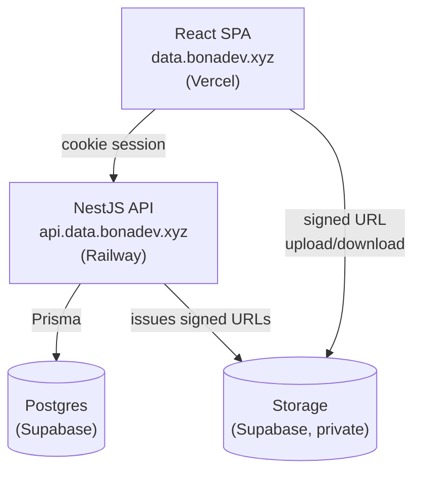

# Data Room

Virtual data room MVP — securely store, organize, and share documents for due
diligence. Full-stack app: NestJS + Postgres/Prisma backend, React frontend.

## Live demo

- Frontend: https://data.bonadev.xyz
- Backend API: https://api.data.bonadev.xyz — health check:
  [`/health`](https://api.data.bonadev.xyz/health)

## Architecture

Full diagram + rationale in [docs/architecture.md](docs/architecture.md).



File bytes go straight from the browser to Storage via signed URLs the API
issues — they never pass through the API itself.

## Tech stack

See [docs/architecture.md](docs/architecture.md) for full rationale.

- Frontend: React (Vite SPA), TypeScript, Tailwind, Shadcn — hosted on Vercel at
  `data.bonadev.xyz`
- Backend: NestJS — hosted on Railway at `api.data.bonadev.xyz`, called directly
  (no proxy)
- Database: Postgres via Supabase
- File storage: Supabase Storage
- Auth: Better Auth (Google OAuth2 + email/password), httpOnly cross-subdomain
  cookie session (`.data.bonadev.xyz`)
- Package manager: pnpm
- Frontend data: TanStack Query + TanStack Table
- Monorepo: pnpm workspaces — `apps/web`, `apps/api`, `packages/shared`
- CI/CD: Vercel/Railway auto-deploy on push to `main` (native git integration);
  GitHub Actions runs typecheck/lint/tests as a required check on PRs

## Design decisions

Full rationale lives in [docs/architecture.md](docs/architecture.md). Summary:

- Frontend: Vite SPA, not Next (not the task's named stack) or TanStack Start
  (immature, and its main draw — same-origin auth — is already solved by
  cross-subdomain cookies on a shared root domain)
- Auth: Better Auth (not Passport), httpOnly cross-subdomain cookie session
  (frontend and backend call each other directly, no proxy), not a client-held
  JWT
- Supabase used for DB + Storage only, not Auth — auth is rolled by hand since the
  task names NestJS + Postgres + Prisma as the expected stack
- pnpm as package manager
- TanStack Table (headless) drives both list and grid views of files/folders from
  one shared sort/filter/pagination state; TanStack Query handles server state
- pnpm workspaces monorepo (no Turborepo/Nx): `apps/web`, `apps/api`,
  `packages/shared` for types/DTOs/zod schemas shared between frontend and backend
- Deploys are native Vercel/Railway git integration, not a GH Actions deploy
  step; GitHub Actions only runs CI (typecheck/lint/tests), required on PRs
- File storage: private Supabase bucket, object key = `fileId`, client uploads
  directly to Storage via backend-issued signed URLs, authorization stays in
  Postgres (no Supabase Storage RLS policies)

Not yet decided (tracked in docs/architecture.md):

- TODO: folder tree storage strategy for subtree size & item count aggregation
- TODO: sharing model (public link vs. permissioned, role extensibility)
- TODO: name-conflict resolution on upload/rename

## Data model / ERD

TODO — not designed yet.

## Setup instructions

```bash
corepack enable
pnpm install

cp apps/api/.env.example apps/api/.env   # fill in DB/Supabase/auth values
cp apps/web/.env.example apps/web/.env

pnpm dev   # runs apps/api and apps/web together
```

`apps/api` needs a Postgres connection (`DATABASE_URL`/`DIRECT_URL`) before it can do
anything beyond `/health` — no models are defined yet (see Data model section below).

## How it scales

TODO — answer once the data model is decided:

- How do you compute the total size and item count of a folder including its whole
  subtree?
- What changes when one Data Room holds 100,000 files (listing, pagination,
  indexes)?
- How does sharing extend to per-user roles (viewer/editor) without remodeling?

## AI usage note

TODO — fill in once the build is further along.
