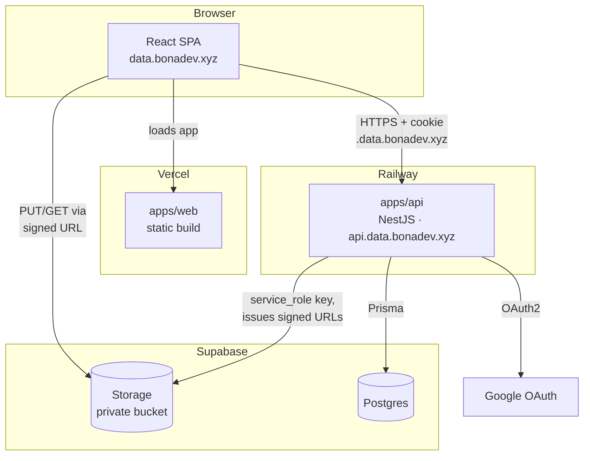
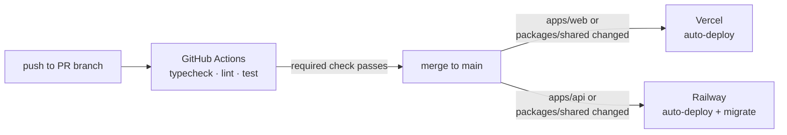

# Architecture

Status: work in progress. This document captures decisions made so far, in the order
we made them. Data model, API design, sharing model, and file upload flow are not
decided yet and will be added as separate sections later.

## Diagram

File bytes never pass through `apps/api` — the browser talks to Storage directly
for both upload and download, using signed URLs the backend issues after checking
Postgres. Everything else (folders, sharing, metadata) goes through the API.

## Hosting

| Component           | Where                           | Why                                                                            |
| ------------------- | ------------------------------- | ------------------------------------------------------------------------------ |
| Frontend            | Vercel, `data.bonadev.xyz`      | Recommended by the task; standard fit for a React/Next app                     |
| Backend (NestJS)    | Railway, `api.data.bonadev.xyz` | Simple Node deploy from git, generous free tier                                |
| Database (Postgres) | Supabase                        | Managed, no separate provisioning needed                                       |
| File storage        | Supabase Storage                | S3-compatible, lives next to the DB, avoids standing up a separate AWS account |

Decided against Supabase Auth even though Supabase is already in the stack: the task
explicitly names NestJS + Postgres + Prisma as the expected stack, and rolling our own
auth is part of what's being evaluated. Offloading it to Supabase Auth would remove a
piece of the demonstrated backend work.

## Frontend framework: Vite SPA

Considered and rejected:

- **Next.js** — not the stack the task names (task says "we use React /
  TypeScript / Tailwind / Shadcn", not Next). Rejecting it isn't about Next's
  quality, just stack conformance: no reason to bring in extra framework surface
  the task doesn't ask for.
- **TanStack Start** — went through two rounds:
  1. Rejected first: v0, its Nitro plugin is marked actively-in-development, and
     running two runtimes (edge + Node backend) is an extra moving part for no
     clear gain.
  2. Reconsidered once it became clear that, without a BFF, auth is the murkiest
     part of the system — Start keeps the session first-party on a single origin,
     no custom domain wiring needed, API never exposed publicly. At that point
     Start looked worth the Nitro setup cost, more so than a plain Vite SPA.
  3. That reason then disappeared: `data.bonadev.xyz` and `api.data.bonadev.xyz`
     share a parent domain, so cookies scoped to `.data.bonadev.xyz` (see Auth
     below) are same-site, not cross-site, in the browser's eyes — no
     third-party-cookie blocking, no same-origin trick needed. Direct
     cross-subdomain requests already solve the auth problem Start was brought
     in for.
  - What Start still offered: SSR on the public `/s/:token` share route would
    produce an OG preview when a shared link is pasted into Slack/etc. Nice, but
    not worth adopting a whole framework (plus its immaturity) for.

Conclusion: nothing in this app needs SSR — everything meaningful sits behind
auth, and the one public route's OG-preview nicety isn't worth the cost. The
cross-subdomain cookie already handles auth without a same-origin trick, so a
frontend framework with a server isn't needed at all. **Vite SPA** gets the same
result with fewer moving parts, talking directly to `api.data.bonadev.xyz`.

## Frontend libraries: TanStack Query + TanStack Table

- **TanStack Query** for server state: caches folder/file listings, invalidates on
  mutations (move/rename/delete/upload), background refetch. Not tied to TanStack
  Start — works standalone in any React app.
- **TanStack Table** for the file/folder list: headless, so it only owns state
  (sorting, filtering, pagination, row model) and leaves rendering to us — the same
  row model can be mapped to `<table>` rows for list view or to cards for grid
  view (Drive supports both), sharing one sort/filter/pagination state across both.
  Also the natural place to hang virtualization for the 100k-files scale case (see
  Open questions).

## Auth

- Library: **Better Auth**, not Passport.
  - Passport is the idiomatic NestJS choice but requires a Strategy + Guard class per
    provider (Google, local, JWT) — roughly 150-250 lines across 6-8 files for minimal
    coverage.
  - Better Auth needs one config object (Prisma adapter, `emailAndPassword`,
    `socialProviders.google`) mounted via `app.use()` in `main.ts`, plus one guard that
    calls `auth.api.getSession()`. Less idiomatic-Nest boilerplate, but the task is
    evaluated on data model/sharing/UX, not on auth scaffolding, so the trade-off favors
    less code.
- Methods: Google OAuth2 + email/password, per task requirements.
- Session transport: **httpOnly cookie**, not a JWT kept in localStorage/state —
  avoids token theft via XSS entirely (no JS-readable token to steal).

## Cross-subdomain cookie setup

Domain: **bonadev.xyz** (personal domain, hosts other projects too). Frontend calls
`api.data.bonadev.xyz` directly — no rewrite proxy. (A Vercel rewrite proxy was
considered, to make the browser see a single origin, but rejected: this app is
upload-heavy, and proxying file bodies through Vercel's edge adds a hop and its own
size/streaming limits for no real benefit once cross-subdomain cookies already work.)

- Frontend: `data.bonadev.xyz`
- Backend: `api.data.bonadev.xyz` (nested under `data.bonadev.xyz`, not a sibling
  of it — keeps this app's subdomains grouped and out of the way of other projects
  on `bonadev.xyz`)

Frontend and backend are on different subdomains, so the session cookie needs to be
readable across both:

- Cookie domain: `.data.bonadev.xyz` (leading dot, scoped to this app's subdomain
  tree, **not** the bare `.bonadev.xyz` root) — narrower scope means the cookie
  never gets sent to unrelated projects on the same root domain. `data.bonadev.xyz`
  and `api.data.bonadev.xyz` share this parent, so it's still a same-site request
  from the browser's perspective, not cross-site.
- Better Auth config: `crossSubDomainCookies: { enabled: true, domain: ".data.bonadev.xyz" }`.
- Backend CORS: `credentials: true`, origin allow-list = `https://data.bonadev.xyz`.
- Frontend: all API calls use `credentials: 'include'`; no manual token storage/attachment.

## Tooling

- Package manager: **pnpm**. Content-addressable store avoids duplicating packages on
  disk, hard-links make installs faster than npm/yarn, and it blocks phantom
  dependencies (importing a package that's only a transitive dep, not a direct one).

## Monorepo layout

Single repo, pnpm workspaces — no Turborepo/Nx, plain workspaces are enough at this
size and skip extra build-orchestration config for a time-boxed project.

- `apps/web` — frontend (Vite SPA)
- `apps/api` — backend (NestJS)
- `packages/shared` — TS types/interfaces shared between both (DTOs, enums like
  `ShareMode`/role), and zod schemas used for validation on both sides: NestJS DTOs
  validate with the same schema the frontend uses for form validation, so the
  contract can't drift between client and server.

## CI/CD

Deployment and CI are kept separate — deployment doesn't run through GitHub
Actions at all:

- **CD**: native git integrations, no custom deploy scripts. Both sides must
  rebuild when `packages/shared` changes, not just when their own app dir
  changes:
  - Vercel: root directory `apps/web`, auto-deploys on push to `main`, preview
    deployment per PR. Ignored Build Step set to
    `git diff --quiet HEAD^ HEAD -- apps/web packages/shared` — exits 0 (skip
    build) when a push only touches `apps/api`, exits non-zero (build) when
    `apps/web` or `packages/shared` changed. Both paths are in the command, so
    a shared-only change still triggers a web rebuild.
  - Railway: root directory `apps/api`, watch paths explicitly include
    `packages/shared` (unlike Vercel, Railway needs this listed or a
    shared-only change won't trigger an API redeploy), auto-deploys on push to
    `main`. Builds via Railway's Nixpacks (auto-detects Node/pnpm, no
    Dockerfile to write/maintain) — needs the monorepo build order (install at
    repo root, build `packages/shared`, then build/start `apps/api`) set
    explicitly via root directory + build/start commands. Falls back to a
    hand-written Dockerfile only if Nixpacks can't handle that.
  - Migrations: `prisma migrate deploy` runs as part of Railway's start command,
    before the server boots — not a separate CI step.
- **CI**: a GitHub Actions workflow (`pnpm install` → typecheck → lint → tests)
  runs on every PR. Even solo, work happens through PRs into `main` with branch
  protection requiring this check to pass — catches breakage before it reaches
  `main`, where Vercel/Railway would otherwise deploy it immediately.

## File storage (Supabase Storage)

- **Bucket is private**, never public. Even the "public link" share mode doesn't
  rely on a public bucket policy — the backend checks the `Share` row in Postgres
  and issues a short-TTL signed URL itself. Keeping authorization solely in
  Postgres/Nest avoids running two permission systems (app logic + Supabase
  Storage/RLS policies) that could drift apart.
- **Object key = `fileId` (UUID)**, not the file's display name/path. Renaming or
  moving a file in the folder tree only changes rows in Postgres; the stored
  object never needs to move.
- **Upload goes client → Storage directly**, not through the backend: client
  requests a signed upload URL for a given `fileId`, PUTs the file straight to
  Supabase Storage, then confirms completion to the backend. Keeps file bytes off
  the Railway process (memory/bandwidth) and gives real per-file progress via the
  upload request itself.
- **One bucket for the whole app**, not one per Data Room — granularity of access
  lives in Postgres rows, not in bucket structure.
- Backend talks to Storage with the **service_role key** (server-side only, never
  shipped to the client); no Supabase Storage RLS policies are used.

## Open questions / not yet decided

- Data model (Data Room / Folder / File / Share) and ERD
- Folder tree strategy for subtree size/count aggregation at scale
- Exact upload-confirm / download-URL API endpoints (shape decided above, routes not yet)
- Sharing model (public link vs. permissioned, role extensibility)
- API surface
