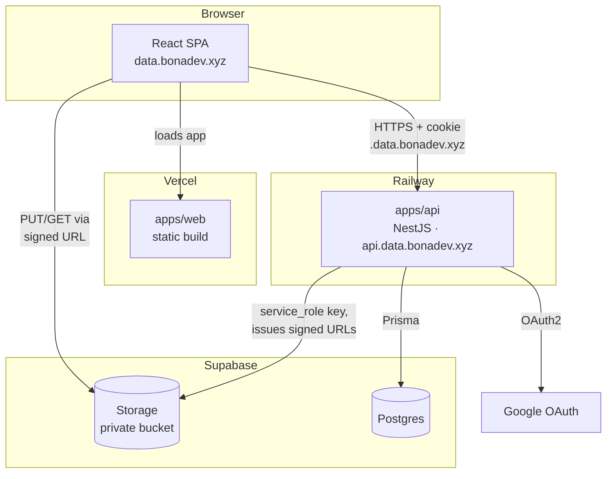
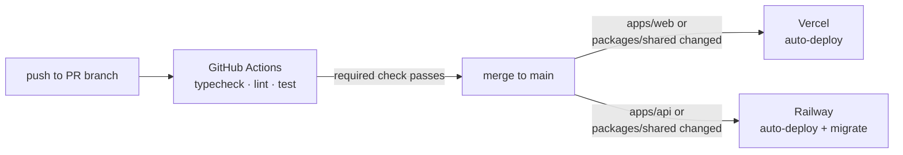
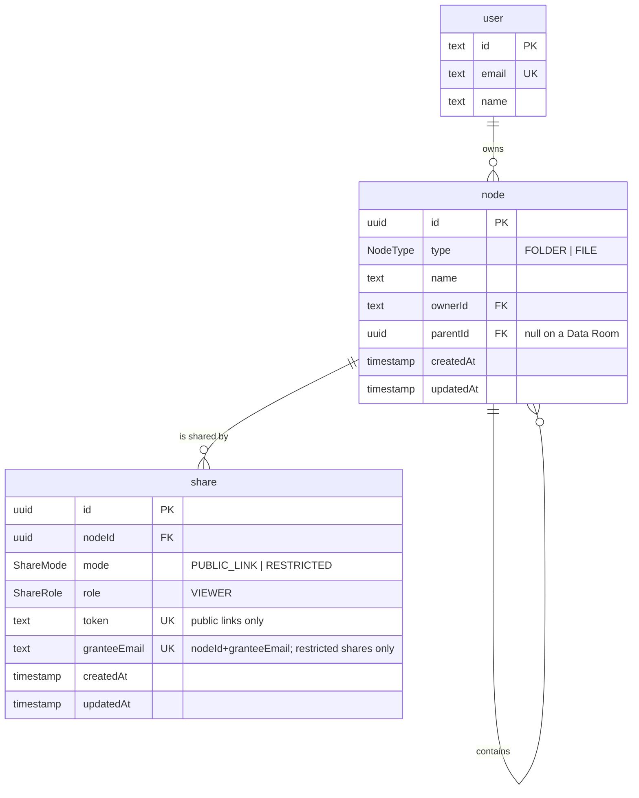

# Architecture

Status: work in progress. This document captures decisions made so far, in the order
we made them.

## Diagram

File bytes never pass through `apps/api` — the browser talks to Storage directly
for both upload and download, using signed URLs the backend issues after checking
Postgres. Everything else (folders, sharing, metadata) goes through the API.

## Hosting

| Component           | Where                           | Why                                                                            |
| ------------------- | ------------------------------- | ------------------------------------------------------------------------------ |
| Frontend            | Vercel, `data.bonadev.xyz`      | Recommended by the task; standard fit for a React/Next app                     |
| Backend (NestJS)    | Railway, `api.data.bonadev.xyz` | Simple Node deploy from git, generous free tier                                |
| Database (Postgres) | Supabase                        | Managed, no separate provisioning needed                                       |
| File storage        | Supabase Storage                | S3-compatible, lives next to the DB, avoids standing up a separate AWS account |

Decided against Supabase Auth even though Supabase is already in the stack: the task
explicitly names NestJS + Postgres + Prisma as the expected stack, and rolling our own
auth is part of what's being evaluated. Offloading it to Supabase Auth would remove a
piece of the demonstrated backend work.

## Frontend framework: Vite SPA

Considered and rejected:

- **Next.js** — not the stack the task names (task says "we use React /
  TypeScript / Tailwind / Shadcn", not Next). Rejecting it isn't about Next's
  quality, just stack conformance: no reason to bring in extra framework surface
  the task doesn't ask for.
- **TanStack Start** — went through two rounds:
  1. Rejected first: v0, its Nitro plugin is marked actively-in-development, and
     running two runtimes (edge + Node backend) is an extra moving part for no
     clear gain.
  2. Reconsidered once it became clear that, without a BFF, auth is the murkiest
     part of the system — Start keeps the session first-party on a single origin,
     no custom domain wiring needed, API never exposed publicly. At that point
     Start looked worth the Nitro setup cost, more so than a plain Vite SPA.
  3. That reason then disappeared: `data.bonadev.xyz` and `api.data.bonadev.xyz`
     share a parent domain, so cookies scoped to `.data.bonadev.xyz` (see Auth
     below) are same-site, not cross-site, in the browser's eyes — no
     third-party-cookie blocking, no same-origin trick needed. Direct
     cross-subdomain requests already solve the auth problem Start was brought
     in for.
  - What Start still offered: SSR on the public `/s/:token` share route would
    produce an OG preview when a shared link is pasted into Slack/etc. Nice, but
    not worth adopting a whole framework (plus its immaturity) for.

Conclusion: nothing in this app needs SSR — everything meaningful sits behind
auth, and the one public route's OG-preview nicety isn't worth the cost. The
cross-subdomain cookie already handles auth without a same-origin trick, so a
frontend framework with a server isn't needed at all. **Vite SPA** gets the same
result with fewer moving parts, talking directly to `api.data.bonadev.xyz`.

## Frontend libraries: TanStack Query + TanStack Table

- **TanStack Query** for server state: caches folder/file listings, invalidates on
  mutations (move/rename/delete/upload), background refetch. Not tied to TanStack
  Start — works standalone in any React app.
- **TanStack Table** for the file/folder list: headless, so it only owns state
  (sorting, filtering, pagination, row model) and leaves rendering to us — the same
  row model can be mapped to `<table>` rows for list view or to cards for grid
  view (Drive supports both), sharing one sort/filter/pagination state across both.
  Also the natural place to hang virtualization for the 100k-files scale case (see
  Open questions).

## Auth

- Library: **Better Auth**, not Passport.
  - Passport is the idiomatic NestJS choice but requires a Strategy + Guard class per
    provider (Google, local, JWT) — roughly 150-250 lines across 6-8 files for minimal
    coverage.
  - Better Auth needs one config object (Prisma adapter, `emailAndPassword`,
    `socialProviders.google`) mounted via `app.use()` in `main.ts`, plus one guard that
    calls `auth.api.getSession()`. Less idiomatic-Nest boilerplate, but the task is
    evaluated on data model/sharing/UX, not on auth scaffolding, so the trade-off favors
    less code.
- Methods: Google OAuth2 + email/password, per task requirements.
- Session transport: **httpOnly cookie**, not a JWT kept in localStorage/state —
  avoids token theft via XSS entirely (no JS-readable token to steal).

## Cross-subdomain cookie setup

Domain: **bonadev.xyz** (personal domain, hosts other projects too). Frontend calls
`api.data.bonadev.xyz` directly — no rewrite proxy. (A Vercel rewrite proxy was
considered, to make the browser see a single origin, but rejected: this app is
upload-heavy, and proxying file bodies through Vercel's edge adds a hop and its own
size/streaming limits for no real benefit once cross-subdomain cookies already work.)

- Frontend: `data.bonadev.xyz`
- Backend: `api.data.bonadev.xyz` (nested under `data.bonadev.xyz`, not a sibling
  of it — keeps this app's subdomains grouped and out of the way of other projects
  on `bonadev.xyz`)

Frontend and backend are on different subdomains, so the session cookie needs to be
readable across both:

- Cookie domain: `.data.bonadev.xyz` (leading dot, scoped to this app's subdomain
  tree, **not** the bare `.bonadev.xyz` root) — narrower scope means the cookie
  never gets sent to unrelated projects on the same root domain. `data.bonadev.xyz`
  and `api.data.bonadev.xyz` share this parent, so it's still a same-site request
  from the browser's perspective, not cross-site.
- Better Auth config: `crossSubDomainCookies: { enabled: true, domain: ".data.bonadev.xyz" }`.
- Backend CORS: `credentials: true`, origin allow-list = `https://data.bonadev.xyz`.
- Frontend: all API calls use `credentials: 'include'`; no manual token storage/attachment.

## Tooling

- Package manager: **pnpm**. Content-addressable store avoids duplicating packages on
  disk, hard-links make installs faster than npm/yarn, and it blocks phantom
  dependencies (importing a package that's only a transitive dep, not a direct one).

## Monorepo layout

Single repo, pnpm workspaces — no Turborepo/Nx, plain workspaces are enough at this
size and skip extra build-orchestration config for a time-boxed project.

- `apps/web` — frontend (Vite SPA)
- `apps/api` — backend (NestJS)
- `packages/shared` — TS types/interfaces shared between both (DTOs, enums like
  `ShareMode`/role), and zod schemas used for validation on both sides: NestJS DTOs
  validate with the same schema the frontend uses for form validation, so the
  contract can't drift between client and server.

## CI/CD

Deployment and CI are kept separate — deployment doesn't run through GitHub
Actions at all:

- **CD**: native git integrations, no custom deploy scripts. Both sides must
  rebuild when `packages/shared` changes, not just when their own app dir
  changes:
  - Vercel: root directory `apps/web`, auto-deploys on push to `main`, preview
    deployment per PR. Ignored Build Step set to
    `git diff --quiet HEAD^ HEAD -- . ../../packages/shared` — runs with cwd =
    Root Directory (`apps/web`), so paths are relative to that, not the repo
    root (a repo-root-relative version of this command shipped first and
    silently skipped every build, since `apps/web/apps/web` and
    `apps/web/packages/shared` never exist). Exits 0 (skip build) when a push
    only touches `apps/api`, exits non-zero (build) when `apps/web` or
    `packages/shared` changed — both paths are in the command, so a
    shared-only change still triggers a web rebuild.
  - Railway: **no Root Directory override** — service Source stays at the repo
    root, config lives in `railway.json` at the repo root (not inside
    `apps/api`), and `buildCommand`/`startCommand` use `pnpm --filter <pkg>`
    from the repo root rather than a Root-Directory-scoped `cd`/`-C`. Watch
    paths explicitly include `packages/shared` (unlike Vercel, Railway needs this
    listed or a shared-only change won't trigger an API redeploy). Builds via
    Railway's Nixpacks (auto-detects Node/pnpm, no Dockerfile to write/
    maintain) — install phase stays on Nixpacks' default, `buildCommand`
    explicitly builds `packages/shared` then `apps/api`. Falls back to a
    hand-written Dockerfile only if Nixpacks can't handle that.
  - Migrations: `prisma migrate deploy` runs as part of Railway's start command,
    before the server boots — not a separate CI step.
- **CI**: a GitHub Actions workflow (`pnpm install` → build → typecheck → lint →
  tests) runs on every PR. The tests are unit tests over dependency-free code —
  name rules, path arithmetic — so CI needs no database. Tests that need a real
  Postgres arrive with the sharing rules, where a silent mistake shows someone
  else's documents and is worth a service container. Even solo, work happens
  through PRs into `main` with branch protection requiring this check to pass —
  catches breakage before it reaches `main`, where Vercel/Railway would otherwise
  deploy it immediately.

## File storage (Supabase Storage)

- **Bucket is private**, never public. Even the "public link" share mode doesn't
  rely on a public bucket policy — the backend checks the `Share` row in Postgres
  and issues a short-TTL signed URL itself. Keeping authorization solely in
  Postgres/Nest avoids running two permission systems (app logic + Supabase
  Storage/RLS policies) that could drift apart.
- **Object key = `fileId` (UUID)**, not the file's display name/path. Renaming or
  moving a file in the folder tree only changes rows in Postgres; the stored
  object never needs to move.
- **Upload goes client → Storage directly**, not through the backend: client
  requests a signed upload URL for a given `fileId`, PUTs the file straight to
  Supabase Storage, then confirms completion to the backend. Keeps file bytes off
  the Railway process (memory/bandwidth) and gives real per-file progress via the
  upload request itself.
- **One bucket for the whole app**, not one per Data Room — granularity of access
  lives in Postgres rows, not in bucket structure.
- Backend talks to Storage with the **service_role key** (server-side only, never
  shipped to the client); no Supabase Storage RLS policies are used.
- **The client PUTs to the signed URL directly with `XMLHttpRequest`**, not the
  Supabase SDK's `uploadToSignedUrl()` helper: that helper wraps `fetch`, which
  has no upload-progress event, and per-file progress is a task requirement.
  `createSignedUploadUrl()`'s response already includes a self-contained URL
  (token embedded as a query param) that a plain PUT can hit — confirmed against
  Supabase's own OpenAPI spec — so the SDK is a backend-only dependency;
  `apps/web` never needs it.
- **Completion re-derives the size from Storage**, not the client-reported value
  the upload-url request carried — `POST /files/:id/complete` lists the object
  and stores its real byte count, and treats a missing object as "hasn't
  uploaded yet" rather than blindly trusting the PUT happened. Supabase's signed
  upload URLs carry no per-token size limit of their own, so the 50 MB cap from
  `packages/shared` is enforced client-side and at creation time; nothing yet
  re-checks the actual uploaded bytes against that cap at completion — a known
  gap, not built in slice 3.
- **A pending row that's never completed is swept lazily**, on the next read of
  its folder, once it's older than 24h — no scheduler, reusing the read path
  that already decides what a folder contains.
- **Deleting a file (or a folder with files inside) removes its Storage
  object(s) too**, best-effort: the object keys under the node are collected
  before the Postgres delete, then removed from Storage after it succeeds. A
  Storage failure only logs — it never turns an already-succeeded node delete
  into a 500, so the tradeoff is a possible orphaned object over an
  undeletable node.

## Upload validation and name conflicts

- **Type and size are checked client-side before any request goes out**, with a
  `packages/shared` zod schema (`uploadFileSchema`) the browser and, later, the
  `POST /files/upload-url` endpoint both apply — one schema, so a file the form
  accepts is never one the API then rejects. Type is `application/pdf` only ("PDF
  is enough" per the task); size is capped at 50 MB per file — generous for
  due-diligence documents, including large scanned contracts, but tight enough
  that the check catches a real mistake (a video dragged in by accident) rather
  than being decorative.
- **A name conflict on upload is rejected, never silently resolved** —
  `Report.pdf` uploaded into a folder that already has one gets a 409, same as a
  folder name collision (slice 2). Files share the `node` table and its
  `(parentId, name)` unique index with folders, so this isn't new server-side
  work, just the existing rule applying to a second `type`.
- **A batch drop can collide with itself**, something a single `POST /folders`
  never had to handle: two files named `Report.pdf` dropped together would both
  hit the same 409 from the server, one after wasting a signed URL. Caught
  client-side instead, before any request: `findDuplicateNamesInBatch` flags the
  second occurrence in the queue immediately. Case-sensitive, matching the name
  rule itself (`Report.pdf` and `report.pdf` are different names).

## Data model

**A Data Room is a folder without a parent.** There is no separate `DataRoom`
entity: it would hold nothing but its owner, and the owner sits on `node.ownerId`
directly, where every access check reads it without a join. The task itself
describes a Data Room as "the top-level folder or drive", and the model says the
same thing. One room per user, created on first sign-in and never created or
deleted by hand; a partial unique index (`ownerId` where `parentId IS NULL`)
enforces that in the database, which also settles the race when a user signs in
from two tabs at once. The room is renamable, and it can be shared — sharing a
Data Room, a folder or a single file is one requirement, not three.

**Folders and files share one table**, discriminated by `type`. The subtree walk
behind counts, sizes, deletion and access checks is then written once and already
counts files correctly before the first file exists. The price is columns that only
files use (`size`, `mimeType`, `storageKey` arrive in slice 3) sitting empty on
folder rows. A file also carries `status` (`PENDING` while the row exists but the
upload to Storage hasn't been confirmed yet, `READY` once it has) — the state a
pending-upload row is in before the client PUTs its bytes and confirms.

**`type` has no `ROOM` value**, even though a room is a distinct thing in the UI.
A room behaves like a folder in every operation — it holds children, it is a move
target, it can be renamed, shared and measured — and differs only in two
prohibitions: it can't be deleted and can't be moved, both checked as "the node has
no parent". A third type would invite `type = FOLDER` checks that silently exclude
the room, and the folder picker in the move dialog is exactly where that bug would
land.

**Ancestry is materialized in `node.path`** — the ids of every ancestor, wrapped
in slashes (`/roomId/legalId/`, `/` on a Data Room) — so "what is inside this
folder" is a prefix scan rather than a recursive walk down `parentId`. Measured on
100k nodes in a local Postgres with default settings:

|                           | recursive CTE over `parentId` | prefix scan over `path` |
| ------------------------- | ----------------------------- | ----------------------- |
| count a 100k-node subtree | 304 ms                        | **21 ms**               |
| count a 10k-node subtree  | 140 ms                        | **2.5 ms**              |
| move a 10k-node subtree   | free (one column)             | 250 ms (one `UPDATE`)   |

The recursion is slower than the row count alone suggests: under the default 4 MB
`work_mem` its working table spills ~27 MB to temp files, and Supabase's free tier
is exactly that environment. Raising `work_mem` to 64 MB brought it to 125 ms —
still six times the prefix scan, and not a setting we control in production.

Three consequences worth knowing. The index has to be
`(path text_pattern_ops, type)`: without `text_pattern_ops` a `LIKE` prefix can't
use the index at all and reads the whole table, which is _worse_ than the
recursion it replaces, and carrying `type` is what makes counting an index-only
scan. The column costs 153 bytes per row (~15 MB per 100k nodes), while its index
stays around 1 MB because siblings share a path and btree deduplicates it. And
because a path duplicates what `parentId` already says, the two can drift: the
node service is the only writer, and it keeps them in step inside one transaction
— chosen over a database trigger for the same reason we skipped Supabase Storage
policies, one set of rules in one place.

Nesting is capped at 32 levels (`MAX_TREE_DEPTH`): each level adds an id plus a
separator to an indexed value, and a btree key tops out near 2.7 KB.

If subtree counts ever get hot enough that even 21 ms matters, the next step is
cached counters on folder rows, maintained on write — an additive migration, not a
remodelling.

**Deletion is permanent**, with the subtree following through a self-referencing
`ON DELETE CASCADE`. Soft deletion would buy a trash bin the task doesn't ask for,
and charge for it with a "hide deleted rows" filter in every query — including the
share access path, where forgetting it leaks a deleted file to a link recipient.
"Someone deleted the folder you're viewing" is handled where it belongs: a 404, a
toast, and a move to the parent.

**Names are unique per folder and case-sensitive** — `Report.pdf` and `report.pdf`
coexist, as they do in Google Drive and on Linux. Normalization is a trim, nothing
more. A case-insensitive rule would need an index over `lower(name)`, which Prisma
cannot express in the schema and would report as drift on every later migration.

**`Share` ships with the tree**, in slice 2's migration, though nothing reads it
before slice 6 — so the model is decided once instead of being remodelled halfway.
A share always points at a node, which is what keeps "share the whole Data Room"
from becoming a second branch in the access rules. `mode` and `role` start with one
value each: `RESTRICTED` arrives in slice 7 as a second `mode`, `EDITOR` stays the
extension point for per-user roles. Adding a value to an enum is not a remodelling.
Revoking a share deletes its row.

**A restricted share's grantee is an email column (`granteeEmail`), not a
foreign key to `User`.** Access is resolved by comparing the caller's session
email against it at read time (slice 7's logic), never by a stored link kept
in sync on sign-up — the same choice the Data Room's own creation already
makes ("on first read rather than during sign-up: it keeps the API
independent of Better Auth's hooks and works for accounts that predate the
feature"). A `granteeId` FK would need exactly the hook this app has twice
avoided, just to answer "has this email signed up yet" — comparing the email
directly answers it for free, on every read, with nothing to fall out of
sync. `@@unique([nodeId, granteeEmail])` keeps one grantee per node per
email; NULLs don't collide in a unique index, so public links (`granteeEmail`
always `NULL`) are untouched by it.

## Sharing

**A public link's token is 32 random bytes, base64url-encoded** — not the
share row's own id and not a sequential value, so a token can't be narrowed
down by guessing or enumeration the way an id could be. Generated once at
share creation; nothing rotates or expires it — revoking means deleting the
`Share` row, not invalidating a token in place.

**An unknown, malformed, or revoked token, and a node outside the shared
subtree, all answer the same `404`** — the same principle already applied to
node ownership (see API surface below): which of those three it actually was
isn't information a caller without access gets. `AccessService.loadWithinShare`
is the one place every public read path asks this, reusing the same
self-or-descendant path-prefix check the move endpoint already validates
against (`isSelfOrDescendant`, `packages/shared/src/node-move.ts`) — a node
whose ancestor was deleted is simply gone too, by the same cascade that
deletes the `Share` row when the share root itself is removed.

## API surface

| Method | Route                      | Returns                                                     |
| ------ | -------------------------- | ----------------------------------------------------------- |
| GET    | `/me`                      | the signed-in user                                          |
| GET    | `/data-room`               | the caller's Data Room, created on first call               |
| GET    | `/nodes?parentId=`         | a folder's children; without the parameter, the Data Room's |
| GET    | `/nodes/:id/breadcrumb`    | the trail from the Data Room down to the node               |
| GET    | `/nodes/:id/subtree-stats` | `{ folders, files }` for the delete warning                 |
| POST   | `/folders`                 | the created folder                                          |
| PATCH  | `/nodes/:id`               | the renamed node                                            |
| DELETE | `/nodes/:id`               | nothing (204)                                               |
| POST   | `/shares`                  | the public link for a node (idempotent — see Sharing)       |
| GET    | `/shares?nodeId=`          | shares on a node                                            |
| DELETE | `/shares/:id`              | nothing (204) — revokes                                     |

**`GET /s/:token/...`** (root, `nodes?parentId=`, `nodes/:id/breadcrumb`,
`files/:id/download-url`) is the unauthenticated counterpart of the routes
above, scoped to one share's subtree instead of the caller's ownership — see
Sharing for its error policy.

Everything is scoped to the caller: **a node owned by someone else answers 404**,
the same as one that never existed, so the API never confirms that an id is real
to a stranger. A name already taken in the folder answers 409 and is never
silently renamed — the user picked a name, and a rename they didn't ask for is
harder to notice than an error. Deleting a Data Room answers 400: there is no way
to create one, so there is nothing to restore it with.

The Data Room is created on first read rather than during sign-up: it keeps the
API independent of Better Auth's hooks and works for accounts that predate the
feature. Two tabs racing for it is settled by the partial unique index, not by
application locking.

Request bodies are parsed by the same zod schemas the browser's forms use, via
`nestjs-zod`. Nest's usual class-validator would mean a second copy of every rule,
free to drift from the first — a form accepting a name the server rejects is
exactly the kind of UX seam this project is graded on.

## Open questions / not yet decided

- Exact upload-confirm / download-URL API endpoints (shape decided above, routes not yet)
- Listing pagination once a folder holds tens of thousands of rows
