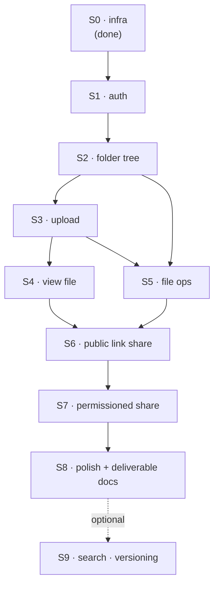

# Roadmap — vertical slices

How the build is sequenced. Each slice is a **vertical** cut: schema → API → UI →
deployed and usable in production. A slice is a unit of user value, not a unit of
review — it lands as the PRs listed under it (each with CI green), and counts as
done only when its whole vertical works on `data.bonadev.xyz`. No slice leaves a
half-wired layer behind.

Rationale for *what* we build lives in [architecture.md](architecture.md); this
file says *in what order* and *what "done" means*. Each slice is tracked as a
GitHub issue collecting its PRs — issue and PR format in [CLAUDE.md](../CLAUDE.md).

## Order of slices

Unknowns first. Auth (S1) and the direct-to-Storage signed URL upload (S3) are the
flows with the most unverified moving parts in production (cross-subdomain cookie,
Google OAuth redirect URIs, CORS on Supabase Storage) — they go early, while there
is room to change the approach. Sharing (S6/S7) is last of the required work
because it reuses the tree read path built in S2–S4: it needs something real to
share.

## Order of PRs inside a slice

Each slice below is written as its PR sequence, in this shape:

1. **migration** — the schema, alone. Riskiest part of the slice, and it reads in
   isolation: the model without the noise of controllers and markup.
2. **logic** — path/name helpers, access rules: no HTTP, dependency-less
   functions, reviewable in a minute and tested in ten. Mixed into controllers,
   both halves get harder to read.
3. **endpoints** — service + controller on top of that logic.
4. **ui** — components and their states against mocks. Doesn't wait for the API,
   and makes loading/empty/error states deliberate work rather than leftovers —
   on mocks they're visible immediately, against a live API only if you break it
   on purpose.
5. **wire up** — the two sides connected, checked by hand in production. Where
   CORS, date formats, and error codes surface. The PR after which the slice's
   issue can be closed.

Not every slice has all five.

---

## S0 · Infra (done)

pnpm workspaces monorepo, NestJS on Railway + Vite SPA on Vercel, custom domains,
CORS, GitHub Actions CI, `/health` end-to-end from the deployed frontend.
Shipped as [#2](https://github.com/denleonchev/data-room/pull/2)–[#5](https://github.com/denleonchev/data-room/pull/5).

---

## S1 · Auth

**Story:** I can sign up / sign in with email+password or Google, stay signed in
across reloads, and sign out. Everything else in the app is behind that.

1. **migration** — Better Auth tables (`user`, `session`, `account`,
   `verification`) via the Prisma adapter. First real migration: it proves the
   migrate-on-deploy path against production while there's nothing to lose.
2. **endpoints** — Better Auth mounted in `main.ts`, `AuthGuard` calling
   `auth.api.getSession()` applied globally with a public-route decorator,
   `GET /me`. (No standalone logic PR — Better Auth owns the rules.)
3. **ui** — `/login` + `/signup` (email/password + "Continue with Google"),
   protected-route shell, user menu, all against a mocked session: wrong
   password, unknown email, duplicate signup email, OAuth denied.
4. **wire up** — real cross-subdomain cookie, Google redirect URIs, 401 → login
   redirect (once, no loop), return to the intended page after login.

- **Done when:** signing in on `data.bonadev.xyz` sets the `.data.bonadev.xyz`
  cookie and `GET /me` succeeds from the browser in production, both methods.
- **Docs:** architecture.md — auth section confirmed against what shipped
  (redirect URIs, cookie flags).
- Scope `auth`. ~2h.

---

## S2 · Data Room + folder tree

**Story:** I sign in and land in my Data Room. I can create folders, nest them,
navigate in and out with breadcrumbs, rename a folder, and delete a folder after
being told what goes with it.

1. **migration** — the whole model, decided once: `DataRoom` (owner → user),
   `Node` (one table for files and folders, discriminated by `type`,
   self-referencing `parentId`, unique index on `(parentId, name)` among live
   rows), and the `Share` table shape. Sharing ships in S6/S7, but its table
   lands here so the model is never remodelled mid-build.
2. **logic** — name normalization and conflict rules, plus the recursive subtree
   walk behind counts and sizes. One `Node` table means that walk already counts
   files correctly before any file exists. Tested against a seeded tree.
3. **endpoints** — `GET /data-room`, `GET /nodes?parentId=`,
   `GET /nodes/:id/breadcrumb`, `POST /folders`, `PATCH /nodes/:id` (rename),
   `DELETE /nodes/:id`, `GET /nodes/:id/subtree-stats`. Data Room auto-created on
   first sign-in.
4. **ui** — listing on TanStack Table (the row model list view uses now and grid
   view reuses in S8), breadcrumbs, inline new-folder row, rename in place,
   delete dialog reading "N folders and M files will be deleted"; empty, loading
   and error states from mock data.
5. **wire up** — TanStack Query cache + invalidation on every mutation, and the
   cross-session cases: deleting the folder you're inside (go to parent), opening
   a folder another tab deleted (404 → toast → parent).

- **Done when:** a signed-in user can build a nested folder structure in
  production, reload, and see it.
- **Docs:** architecture.md — data model + ERD replaces the "open question";
  README ERD section filled in; node zod schemas land in `packages/shared`.
- Scope `nodes`. ~2.5h.

---

## S3 · Upload files

**Story:** I drag a stack of PDFs into a folder and watch each one upload.

1. **migration** — file columns on `Node`: `size`, `mimeType`, `storageKey`
   (= node id), `status` (pending/ready).
2. **logic** — the name-conflict rule (decided here, reused by rename in S5) and
   client-side file validation (type, size) as shared zod schemas in
   `packages/shared`, so the browser and the API reject the same things.
3. **endpoints** — `POST /files/upload-url` (creates the pending row, returns a
   signed Supabase URL), `POST /files/:id/complete` (marks ready, stores size),
   cleanup of orphaned pending rows.
4. **ui** — drop zone over the list + file picker, multi-file queue with per-file
   progress, cancel and retry, driven by a fake uploader so failure and
   cancellation are designed rather than discovered.
5. **wire up** — real PUT to Supabase Storage with progress from the request,
   bucket CORS, network failure mid-upload, tab closed mid-upload (pending rows
   never render as real files).

- **Done when:** multi-file drag-and-drop into a nested folder works in production
  against the private bucket, and the rows survive a reload.
- **Docs:** architecture.md — the conflict rule written down.
- Scope `uploads`. ~2h.

---

## S4 · View file

**Story:** I click a PDF and read it without leaving the app.

1. **endpoints** — `GET /files/:id/download-url`: ownership checked in Postgres,
   short-TTL signed URL returned. The same endpoint serves share viewers in S6.
2. **ui** — inline PDF preview, open in new tab / download, file metadata (size,
   uploaded at), fallback to download for anything not previewable — built
   against a local file.
3. **wire up** — real signed URL, re-request when it expires with the viewer
   open, file deleted while open.

- **Done when:** a PDF uploaded in S3 opens in the browser in production.
- Scope `uploads`. ~1h.

---

## S5 · File operations

**Story:** I can rename a file, move it into another folder, and delete it.

1. **logic** — move validation on top of S2's conflict rules: destination
   conflicts, moving into the folder it already sits in. No new migration — the
   schema from S2/S3 covers it.
2. **endpoints** — `PATCH /nodes/:id` extended with `parentId`, delete for files.
3. **ui** — rename in place, move dialog with a folder picker (drag a row onto a
   folder if it comes cheap), delete confirm.
4. **wire up** — optimistic updates through TanStack Query with rollback on
   error, moving into a folder another session deleted, deleting a file that's
   open in the viewer.

- **Done when:** every file operation the task requires works in production.
- Scope `nodes`. ~2h.

---

## S6 · Public link share

**Story:** I create a link for the Data Room, a folder, or a single file; anyone
with the link gets read-only access to it and everything under it; I can revoke.

1. **logic** — `AccessService`: token generation and resolution, and the "is this
   node inside the shared subtree" walk that every read path will ask. The most
   security-sensitive code in the app, so it lands alone and heavily tested —
   including a node whose ancestor was deleted, and escaping the share root
   upward. No migration: the `Share` table shipped in S2, `role` already carries
   `VIEWER`.
2. **endpoints** — `POST /shares`, `GET /shares?nodeId=`, `DELETE /shares/:id`,
   and the public `GET /s/:token/...` read path scoped to the shared subtree.
3. **ui** — share dialog on any row and on the Data Room itself (copy link,
   revoke), plus the public `/s/:token` route reusing the S2–S4 tree and viewer
   components in read-only mode: no chrome implying write access, breadcrumbs
   stopping at the share root.
4. **wire up** — revoked and unknown tokens, an owner opening their own link.

- **Done when:** a link opened in a logged-out incognito window shows the shared
  subtree and nothing above it, and revoking kills it.
- Scope `sharing`. ~1.5h.

---

## S7 · Permissioned share

**Story:** I grant specific people read access by email; only they can open it; I
can see who has access and revoke per person.

1. **migration** — grantee on `Share` (email, linked to a `user` row once that
   email signs up), mode = `RESTRICTED`.
2. **logic** — `AccessService` extended to merge ownership with "which shares
   reach this node for this user", including the invited-but-not-registered case
   (access starts working on signup).
3. **endpoints** — invite / list / revoke on the same `/shares` routes; the
   authenticated read path consults the merged rules.
4. **ui** — access list in the share dialog (add by email, per-row revoke),
   "Shared with me" entry point, duplicate invite and self-invite handled.
5. **wire up** — a second real account, revoking while the recipient has the page
   open.

- **Done when:** a second account sees only what was shared with it, in
  production.
- **Docs:** README "how it scales" — the viewer/editor question answered by the
  shipped model.
- Scope `sharing`. ~1.5h.

---

## S8 · Polish + deliverable docs

Not a five-step slice — a set of small PRs: grid/list toggle off the shared
TanStack Table row model, empty states, loading skeletons, consistent error
toasts, keyboard and focus pass on dialogs, and a sweep for anything
visible-but-not-implemented (the task explicitly penalises that). Then the README:
setup instructions verified from a clean clone, ERD, "how it scales" (subtree
size/count, 100k files, per-user roles), AI usage note, live URLs. ~1.5h.

---

## S9 · Extra credit (only if time remains)

Search and filter by file name across the Data Room; file versioning on name
conflicts. Both are opt-in extras from the task — not started before S8 is done.
